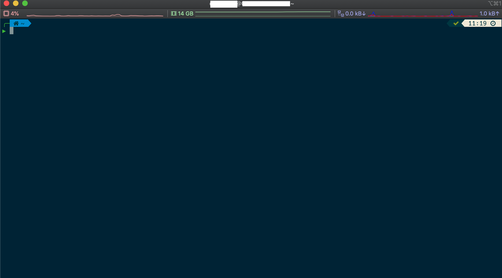
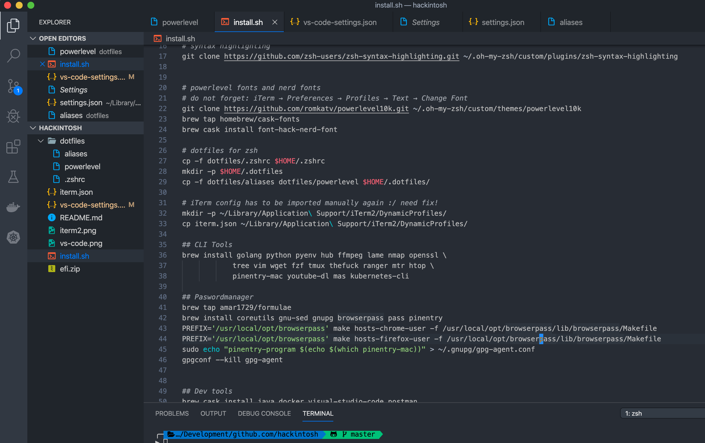

# My Hackintosh

## Current hardware

| Component | Specific component                                                                                                 | URL                                                                                                                    |
| --------- | ------------------------------------------------------------------------------------------------------------------ | ---------------------------------------------------------------------------------------------------------------------- |
| Mainboard | Gigabyte Z390 Gaming X                                                                                             | https://www.gigabyte.com/de/Motherboard/Z390-GAMING-X-rev-10#kf                                                        |
| Processor | Intel Core i5-9600K 4,60 GHz                                                                                       | https://ark.intel.com/content/www/de/de/ark/products/134896/intel-core-i5-9600k-processor-9m-cache-up-to-4-60-ghz.html |
| RAM       | VENGEANCE® LPX Speicherkit 32 GB (2 x 16 GB) DDR4 DRAM 3000 MHz C16 – Schwarz                                      | https://www.corsair.com/de/de/Kategorien/Produkte/Arbeitsspeicher/VENGEANCE-LPX/p/CMK32GX4M2A2400C14                   |
| Graphic   | Sapphire RX 5500 XT Pulse 8G                                                                                       | https://www.sapphiretech.com/en/consumer/pulse-radeon-rx-5500-xt-8g-gddr6                                      |
| PMU       | Seasonic Focus GX - 550W                                                                                           | https://www.mindfactory.de/product_info.php/550-Watt-Seasonic-Focus-GX-80-Plus-Gold-Netzteil--modular_1328547.html     |  |
| Wifi      | Broadcom BCM94360CD 1300Mbps Dual Band 2,4G/5G 802.11AC Desktop PCI-E Wireless Karte PC Wifi Adapter Bluetooth 4,0 | https://www.aliexpress.com/item/32487754245.html?spm=a2g0s.9042311.0.0.521b4c4drENbH6                                  |

## How to install

Follow [this guide](https://www.tonymacx86.com/threads/how-to-create-a-macos-catalina-public-beta-installation-usb.278188/) for catalina usb stick creation and follow [this guide](https://www.tonymacx86.com/threads/unibeast-install-macos-mojave-on-any-supported-intel-based-pc.259381/)

## Post install

1. Configure SMBIOS with [this guide](https://www.tonymacx86.com/threads/guide-how-to-configure-your-systems-smbios-correctly.198155/). Use a mac which cpu matches best your installed cpu.
2. Configure messages with [this guide](https://www.tonymacx86.com/threads/an-idiots-guide-to-imessage.196827/)
3. Configure USB using [this guide](https://github.com/corpnewt/USBMap/)

## Terminal

The install.sh installs many development tools as well as a pre configured iterm2 terminal (sadly the profile has to be manually imported thus it is in the correct directory).
After installation your terminal will look like this:

## Vs-Code

install.sh also installs vs-code. The vs-code-settings.json will be copied to the vs-code user settings (~/Library/Application\ Support/Code/User/).
Those settings will let your vs-code installation look like this:

